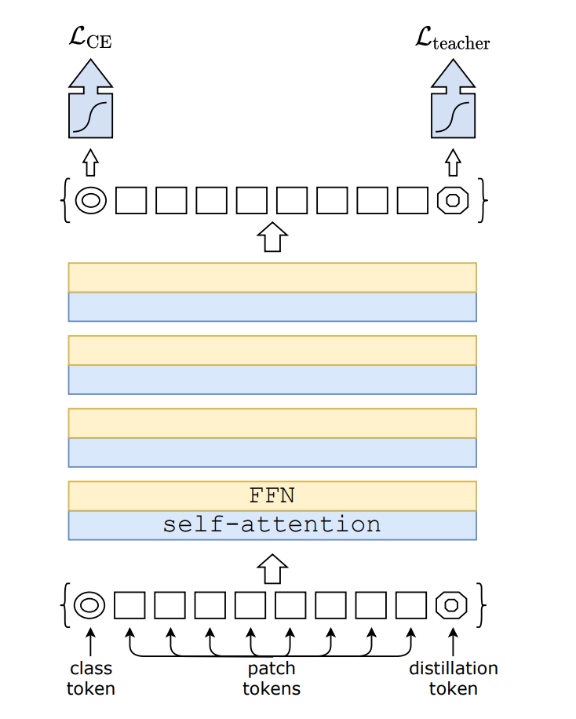

# 视觉transformer

## [2021.01]DeiT: Training data-efficient image transformers & distillation through attention. 

(**强力推荐，21年会有一大堆follow的文章基于这个类似的模型做各种CV任务**)

- 没有卷积，只有transformers结构，只在imagenet数据集上进行训练

- 引入老师-学生策略

  

## [2020.10] AN IMAGE IS WORTH 16X16 WORDS: TRANSFORMERS FOR IMAGE RECOGNITION AT SCALE(ViT). 

在越大的数据集上预训练，取得的效果越好；

不采用额外数据预训练的情况下，模型的性能弱于CNN的方法。

## [2021.03] Swin Transformer: Hierarchical Vision Transformer using ShiftedWindows.

动机：解决尺度问题和计算复杂度高的问题

### Shifted Window based MSA

上图中红色区域是window，灰色区域是patch。W-MSA将输入图片划分成不重合的windows，然后在不同的window内进行self-attention计算。假设一个图片有h*w的patches，每个window包含MxM个patches，那么MSA和W-MSA的计算复杂度分别为：

每个windows内部分别计算各个patch之间的权重

由于window的patch数量远小于图片patch数量，W-MSA的计算复杂度和图像尺寸呈线性关系。

**要保证可以并行计算，需要窗口的大小一致**

### 整体结构

图像输入为H/4*W/4的patch块，每个块的特征维度是4x4x3=48，在stage1部分，先通过linear embedding将patch的特征维度变成C，然后送到Swin Transformer Block，在接下来的stage，将输入按照2x2的相邻patch合并，每个patch的特征维度变成4C，patch块的数量变成H/8xW/8，

## [2021.07] CSWin Transformer: A General Vision Transformer Backbone with Cross-ShapedWindows
动机：global self-attention is very expensive to compute whereas local self-attention often limits the field of interactions of each token

如上图所示，输入特征X由HxW个维度为C的patch组成，首先经过线性变换，得到K个heads，每个head会在水平或者垂直条带内部做local自注意力计算。

计算公式如上图所示，对于水平条带注意力机制，X被分解成不重叠的宽度为sw的条带，每一个条带包含sw*W个tokens，sw表示条带的宽度，计算每个条带内部的自注意力，然后concatenate起来，得到对应head的输出。

整个X的自注意力计算，有各个head的结果concat起来构成。

通过这种条带形式的local SA计算，可以更好地获得图像元素之间的关联。

### 整体结构

**卷积下采样操作**：采用**CvT算法**方式，对于输入的图片，用卷积核对图片进行卷积操作，得到tokens，每个token的维度就是卷积核的通道数，然后在接下来的每一个阶段，用卷积核进行下采样操作，取代线性变换的操作。

## [2021.03] CvT: Introducing Convolutions to Vision Transformers

